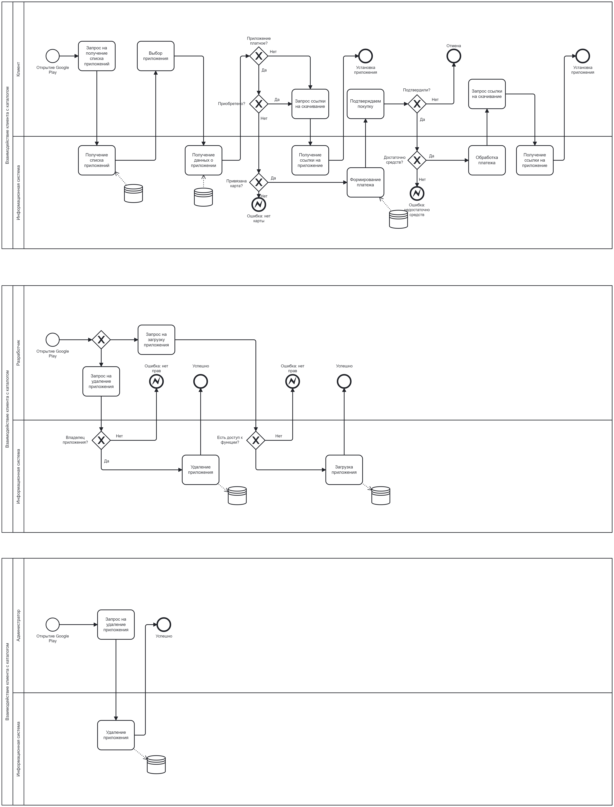
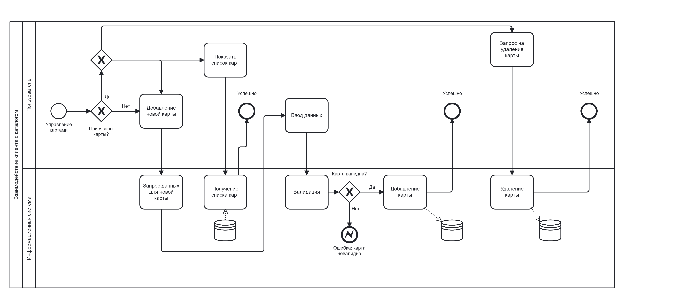
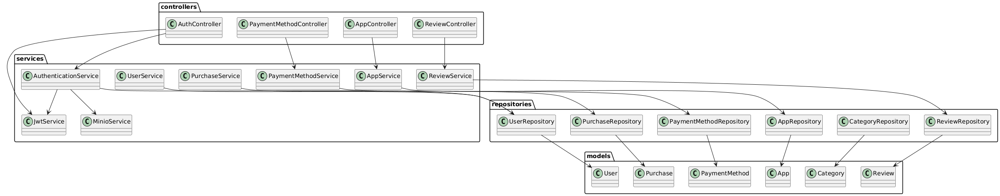
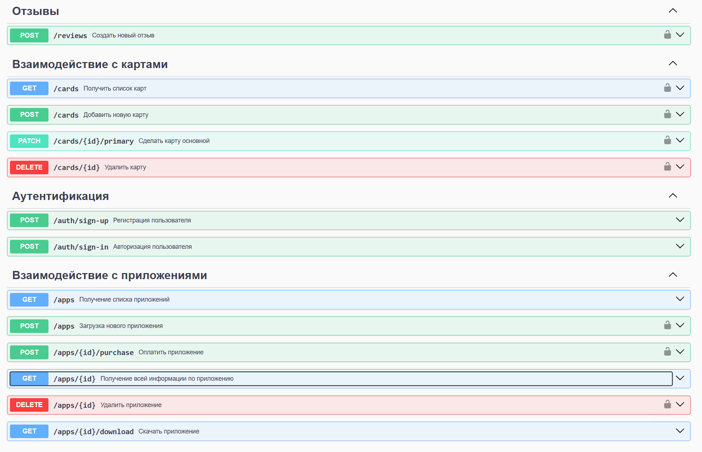

# Бизнес-логика программных систем

## Лабораторная работа №1

Вариант №192

Google Play — приложения и игры — https://play.google.com. 
Бизнес-процесс: взаимодействие клиента с каталогом — выбор приложения, установка и/или покупка, управление картами и платёжными аккаунтами.

### Задание:

Описать бизнес-процесс в соответствии с нотацией BPMN 2.0, после чего реализовать его в виде приложения на базе Spring Boot.

**Порядок выполнения работы:**

1. Выбрать один из бизнес-процессов, реализуемых сайтом из варианта задания.
2. Утвердить выбранный бизнес-процесс у преподавателя.
3. Специфицировать модель реализуемого бизнес-процесса в соответствии с требованиями BPMN 2.0.
4. Разработать приложение на базе Spring Boot, реализующее описанный на предыдущем шаге бизнес-процесс. Приложение должно использовать СУБД PostgreSQL для хранения данных, для всех публичных интерфейсов должны быть разработаны REST API.
5. Разработать набор curl-скриптов, либо набор запросов для REST клиента Insomnia для тестирования публичных интерфейсов разработанного программного модуля. Запросы Insomnia оформить в виде файла экспорта.
6. Развернуть разработанное приложение на сервере helios.

**Содержание отчёта:**

1. Текст задания.
2. Модель потока управления для автоматизируемого бизнес-процесса.
3. UML-диаграммы классов и пакетов разработанного приложения.
4. Спецификация REST API для всех публичных интерфейсов разработанного приложения.
5. Исходный код системы или ссылка на репозиторий с исходным кодом.
6. Выводы по работе.

**Вопросы к защите лабораторной работы:**

1. Понятие бизнес-логики в программных системах. Уровень бизнес-логики в многоуровневой архитектуре программных систем.
2. Основные концепции, используемые при разработке бизнес-логики. CDI, IoC, управление транзакциями, безопасность, распределённая обработка данных.
3. Моделирование бизнес-процессов. BPM и BPMN.
4. Спецификация BPMN 2.0. Принципы составления и основные элементы моделей бизнес-процессов.
5. Объекты потока управления, роли и артефакты в BPMN.
6. Использование Spring Framework для реализации бизнес-логики. Реализация CDI и IoC. Связь уровня бизнес-логики с другими уровнями архитектуры программных систем в Spring.
7. Spring Boot. Способы конфигурации бинов. Двухфазовый, трёхфазовый конструктор.
8. Профили запуска приложения в Spring Boot.

### Выполнение:

**Бизнес процессы:** 



**Диаграмма классов проекта:**


**Набор эндпоинтов для взаимодействия с бекендом:**

Для просмотра более подробного варианта, воспользуйтесь локальной ссылкой:
http://localhost:8080/swagger-ui/index.html#/

Для просмотра содержимого объектного хранилища Minio, воспользуйтесь локальной ссылкой:
http://localhost:9090/
```
username: admin
password: 12345678
```

**Локальный запуск проекта:** 
```
gradle clean build

docker-compose up
# или если уже есть образ бекенда
docker-compose -f docker-compose.prod.yml up
```

**Запуск проекта на сервере:**
```
# На локальной машине
gradle clean build
docker-compose build backend
docker save -o backend.tar lab1-backend
scp backend.tar docker-compose.prod.yml user@ip:/home/

# На сервере 
# Установка Docker
sudo apt-get update
sudo apt-get install -y apt-transport-https ca-certificates curl software-properties-common
curl -fsSL https://download.docker.com/linux/ubuntu/gpg | sudo apt-key add -
sudo add-apt-repository "deb [arch=amd64] https://download.docker.com/linux/ubuntu $(lsb_release -cs) stable"
sudo apt-get update
sudo apt-get install -y docker-ce docker-ce-cli containerd.io
# Установка Docker Compose
sudo curl -L "https://github.com/docker/compose/releases/download/v2.23.0/docker-compose-$(uname -s)-$(uname -m)" -o /usr/local/bin/docker-compose
sudo chmod +x /usr/local/bin/docker-compose
# Добавление пользователя в группу docker
sudo usermod -aG docker $USER
newgrp docker  # Применяем изменения группы без перезагрузки

# Загрузка образа
docker load -i /home/user/backend.tar

# Запуск
docker-compose -f docker-compose.prod.yml up
```
Дальнейшее обращение к эндпоинтам осуществляется по http://server-ip:8080/ вместо http://localhost:8080/

### Вывод:
В ходе работы был успешно реализован бизнес-процесс взаимодействия пользователя с каталогом приложений Google Play: поиск, выбор, установка/покупка и управление платежами.